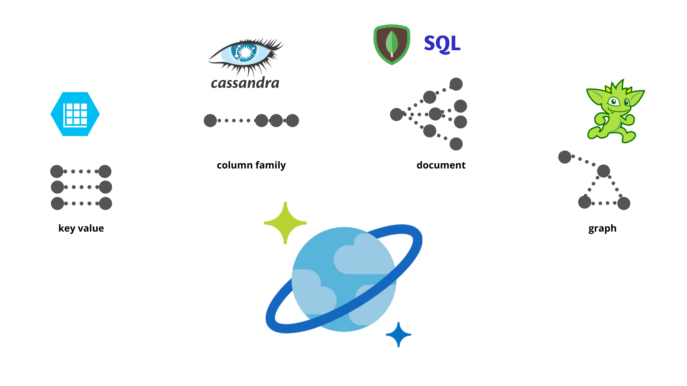
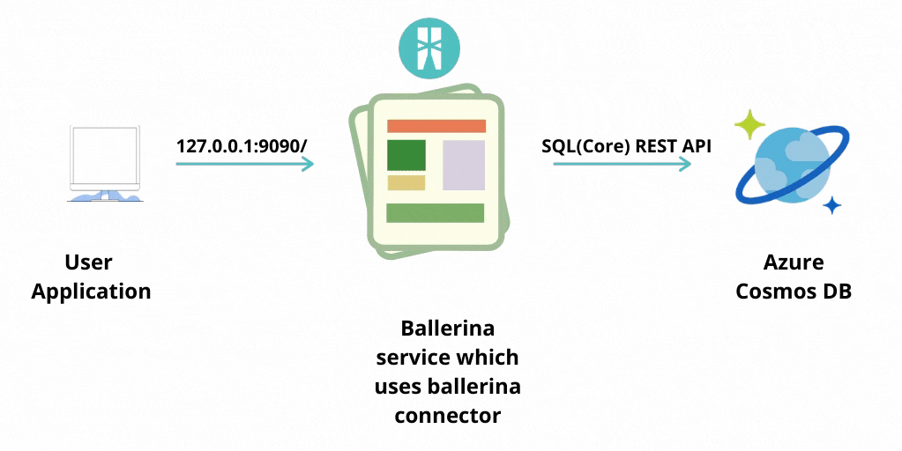

Ballerina Connector For Azure Cosmos DB
===================

[](https://github.com/sachinira/module-ballerinax-azure-cosmosdb/actions?query=workflow%3ACI)
[](https://github.com/sachinira/module-ballerinax-azure-cosmosdb/commits/feature7)
[](https://opensource.org/licenses/Apache-2.0)

Connects to Microsoft Azure Cosmos DB using Ballerina.

# What is Azure Cosmos DB?
[Azure Cosmos DB](https://docs.microsoft.com/en-us/azure/cosmos-db/) is Microsoft’s highly scalable NOSQL database in 
Azure technology stack. It is called a globally distributed multi-model database which is used for managing data across 
the world. Key purposes of the Azure CosmosDB is to achieve low latency and high availability while maintaining a 
flexible scalability. Cosmos DB is a super-set of Azure Document DB and is available in all Azure regions.

# Key features of Azure Cosmos DB 
- Has a guaranteed low latency that is backed by a comprehensive set of Service Level Agreements (SLAs).
- Five Different types of Consistency levels: Strong, Bounded Staleness, Session, Consistent prefix, and Eventual.
- Multi-model approach which provides the ability to use document, key-value, wide-column, or graph-based data. 
- An enterprise grade security. 
- Automatic updates and patching.
- Capacity management with serverless, automatic scaling options. 



# Connector Overview
Azure Cosmos DB Ballerina connector is a connector for connecting to Azure Cosmos DB via Ballerina language easily. 
It provides capability to connect to Azure Cosmos DB and to execute basic database operations like Create, Read, 
Update and Delete Databases and Containers, Executing SQL queries to query Containers etc. Apart from this it allows 
the special features provided by Cosmos DB like operations on JavaScript language integrated queries, management of 
users and permissions. This connector promotes easy integration and access to Cosmos DB via ballerina by handling most 
of the burden on ballerina developers in configuring a new connection to the Cosmos DB from scratch. 

Ballerina Cosmos DB connector uses the SQL(Core) API which has the full support for all the operations and where used 
extensively by the existing developer community. The reason for the use of SQL API is to provide a developer a better 
experience in querying, setting up a database and managing it because most/majority of the developer community has 
familiarity with the use of SQL. For version 0.1.0 of this connector, version 2018-12-31 of Azure Cosmos DB Core REST 
API is used.



# Prerequisites
- Azure Account to access Azure portal. <br/>
https://docs.microsoft.com/en-us/learn/modules/create-an-azure-account/

- Azure Cosmos DB account. <br/>
https://docs.microsoft.com/en-us/azure/cosmos-db/how-to-manage-database-account/

- Azure Cosmos DB Credentials. <br/>
    - Master Key Token or Resource Token
    
        - Obtaining Master Key Token

        When the Azure Cosmos DB account is created, it automatically creates the Master Key credentials. Using the 
        portal you can obtain them easily. There are two sets of master keys, the primary key and the secondary key. 
        The administrator of the account can then exercise key rotation using the secondary key.<br/>
        
        - Obtaining Resource Token
        
        The person who possess the Master Key of the Cosmos DB account is capable of creating Permissions to each User. 
        By using this concept, a ballerina service which uses the Cosmos DB connector can act as a token broker, which 
        issues tokens with specific access rights to users (involves a middle-tier service that serves as the 
        authentication and authorization broker between a client and a back-end service). This is handled by using 
        Resource Tokens. 

        Resource tokens provide user-based permissions to individual account resources, including collections, 
        documents, attachments, stored procedures, triggers, and user-defined functions. They are auto-generated when a 
        Database user is granted permissions to a resource and re-generated in response to a request referencing that 
        permission. By default, they are valid for one hour, with the maximum time-span of five hours.

        More information about tokens can be found here: <br/>
        https://docs.microsoft.com/en-us/rest/api/cosmos-db/access-control-on-cosmosdb-resources <br/>
        Sample for obtaining the Resource Token can be found here: <br/>
        https://github.com/ballerina-platform/module-ballerinax-azure-cosmosdb/blob/master/samples/management-plane/users-permissions/permission/create_permission.bal
        
    - Base URI
    When the Azure Cosmos DB account is created, it automatically creates the Connection Strings and URI. Using the 
    portal you can obtain them easily. <br/>
    
        

- Java 11 installed. <br/>
    Java Development Kit (JDK) with version 11 is required.

- Ballerina SLP8 installed. <br/>
    Ballerina Swan Lake Preview Version 8 is required.

# Supported Versions
|                           | Version                     |
|:-------------------------:|:---------------------------:|
| Cosmos DB API Version     | 2018-12-31                  |
| Ballerina Language        | Swan-Lake-Preview8          |
| Java Development Kit (JDK)| 11                          |

# Limitations
- Only data plane operations are supported from the connector. (Some Management plane operations are not supported)
- Changing the type of throughput in Databases (Auto Scaling -> Manual) is not allowed.
- Only Core(SQL) API is supported.

# Quickstart(s)

## Management of Documents

### Step 1: Import Cosmos DB Package
First, import the ballerinax/azure_cosmosdb module into the Ballerina project.
```ballerina
import ballerinax/azure_cosmosdb as cosmosdb;
```
### Step 2: Initialize the cosmos DB Management Plane Client
You can now make the connection configuration using the Master Key Token or Resource Token, and the resource URI to the 
Cosmos DB Account. For executing management plane operations, the `ManagementClient` should be configured.
```ballerina
cosmosdb:Configuration configuration = {
    baseUrl: <BASE_URL>,
    masterOrResourceToken: <MASTER_OR_RESOURCE_TOKEN>
};

cosmosdb:ManagementClient managementClient = new(configuration);
```
Notes: <br/> You have to specify the `Base URI` and `Master-Token` or `Resource-Token`

### Step 4: Create new Database
You have to create a Database in Azure Account to create a document. For this you have to provide a unique Database ID 
which does not already exist in the specific Cosmos DB account. The ID for this example will be `my_database`. This 
operation will return a record of type Document. This will contain the success as `true` if the operation is successful. 
```ballerina
cosmosdb:Database result = managementClient->createDatabase("my_database");
```
### Step 5: Create new Container
Then, you have to create a Container inside the created Database. As the REST api version which is used in this 
implementation of the connector strictly supports the partition key, it is a necessity to provide the partition key 
definition in the creation of a Container. For this Container it will be created inside `my_database` and ID will 
be `my_container`. The path for partition key is `/gender`. We can set the version of the partition key to 1 or 2.
```ballerina
cosmosdb:PartitionKey partitionKeyDefinition = {
    paths: ["/gender"],
    keyVersion: 2
};
cosmosdb:Container containerResult = check managementClient-> createContainer("my_database", "my_container", 
        partitionKeyDefinition);
```
Notes: <br/> For this operation, you have to have an understanding on how to select a suitable partition key according 
to the nature of documents stored inside. The guide to select a better partition key can be found here: 
https://docs.microsoft.com/en-us/azure/cosmos-db/partitioning-overview#choose-partitionkey


### Step 6: Initialize the Cosmos DB Data Plane Client
For continuing with the data plane operations in Cosmos DB you have to make use of the Data Plane client provided by the 
ballerina connector. For this, the same connection configuration as the `ManagementClient` can be used.
```ballerina
cosmosdb:DataPlaneClient azureCosmosClient = new(configuration);
```
### Step 7: Create a Document
Now, with all the above steps followed you can create a new document inside Cosmos Container. As Cosmos DB is designed 
to store and query JSON-like documents, the document you intend to store must be a JSON object. Then, the document must 
have a unique ID to identify it. In this case the document ID will be `my_document`
```ballerina
record {|string id; json...;|} document = {
        id: "my_document",
        "FirstName": "Alan",
        "FamilyName": "Turing",
        "Parents": [{
            "FamilyName": "Turing",
            "FirstName": "Julius"
        }, {
            "FamilyName": "Stoney",
            "FirstName": "Ethel"
        }],
        "gender": 0
};
int valueOfPartitionKey = 0;

cosmosdb:Document documentResult = check azureCosmosClient-> createDocument("my_database", "my_container", document, 
        valueOfPartitionKey);
```
Notes: <br/> As this container have selected `/gender` as the partition key for `my_container`, the document you create 
should include that path with a valid value.

### Step 8: List the Documents
For listing the existing documents inside this Cosmos Container you have to give `my_database` and `my_container` as 
parameters. Here, you will get a stream of json objects as the response. Using the ballerina Stream API you can access 
the returned results.
```ballerina
stream<cosmosdb:Document> documentList = check azureCosmosClient-> getDocumentList("my_database", "my_container");
var document = documentList.next();
log:print(document?.value);
```
### Step 9: Query Documents
Querying documents is one of the main use-cases supported by a Database. For querying documents inside the Database you 
have created, you have to give `my_database` and `my_container` as parameters. The SQL query must be provided as a 
string. When executing a SQL query using the connector, there are specific ways you can write the query itself and 
provide the optional parameters.More information on this can be found here: 
https://docs.microsoft.com/en-us/rest/api/cosmos-db/querying-cosmosdb-resources-using-the-rest-api

```ballerina
string selectAllQuery = string `SELECT * FROM ${containerId.toString()} f WHERE f.gender = ${0}`;
int partitionKeyValueMale = 0;
int maxItemCount = 10;
stream<Document> queryResult = check azureCosmosClient-> queryDocuments(<DATABASE_ID>, <CONTAINER_ID>, selectAllQuery, 
        maxItemCount, partitionKeyValueMale);

error? e =  resultStream.forEach(function (Document record){
                log:printInfo(record);
            });
```
Notes: <br/> As the Cosmos Containers are creating logical partitions with the partition key provided, you have to 
provide the value of partition key, if the querying must be done in that logical partition.

### Step 10: Delete a given Document
Finally, you can delete the document you have created. For this operation to be done inside the Container created, 
you have to give `my_database` and `my_container` as parameters. Apart from that, the target document to delete
`my_document` and `value of the partition key` of that document must be provided.
```ballerina
cosmosdb:DeleteResponse = check azureCosmosClient->deleteDocument("my_database", "my_container", "my_document", 
        valueOfPartitionKey);
```
# Samples
## Data Plane operations
## Documents
Azure cosmos DB allows the execution of CRUD operations on items separately. As this connector is using the Core API 
underneath, an item may refer to a document in the Container. SQL API stores entities in JSON in a hierarchical 
key-value document. The max document size in Cosmos DB is 2 MB.

### Create a Document
This sample shows how to create a new Document inside a Container. The document contains information about a person's 
family and his/her gender. The Container in which the document will be created has a partition key which has the path 
"/gender". So, the document you create should contain a value for that path. Here, you have to provide 
Database ID, Container ID where the document will be created, A unique ID for the new Document and JSON object which 
represent the Document. As the partition key is made mandatory for the Container, the value for that also should be 
passed as a parameter.

```ballerina
import ballerinax/azure_cosmosdb as cosmosdb;
import ballerina/log;
import ballerina/config;

cosmosdb:Configuration configuration = {
    baseUrl: config:getAsString("BASE_URL"),
    masterOrResourceToken: config:getAsString("MASTER_OR_RESOURCE_TOKEN")
};
cosmosdb:DataPlaneClient azureCosmosClient = new (configuration);

public function main() {
    string databaseId = "my_database";
    // Assume partition key of this container is set as /gender which is an int of 0 or 1
    string containerId = "my_container";
    string documentId = "my_document";

    log:print("Create a new document");
    record {|string id; json...;|} documentBody = {
        id: documentId,
        "FirstName": "Alan",
        "FamilyName": "Turing",
        "Parents": [{
            "FamilyName": "Turing",
            "FirstName": "Julius"
        }, {
            "FamilyName": "Stoney",
            "FirstName": "Ethel"
        }],
        "gender": 0
    };
    int partitionKeyValue = 0;

    var result = azureCosmosClient->createDocument(databaseId, containerId, documentBody, partitionKeyValue); 
    if (result is error) {
        log:printError(result.message());
    }
    if (result is cosmosdb:Document) {
        log:print(result.toString());
        log:print("Success!");
    }
}
```
Notes: <br/> Several Optional Parameters are supported in the creation of documents. These options can be specified in 
`DocumentCreateOptions` record type in the connector.
- `indexingDirective` - This option is to specify whether the document is included in any predefined indexing policy for 
the container. This is provided by giving `Include` or `Exclude`.
- `isUpsertRequest` - You can convert the creation of a new document into an upsert request by using this parameter. 
Must be a boolean value.

Sample is available at: https://github.com/ballerina-platform/module-ballerinax-azure-cosmosdb/blob/master/samples/data-plane/documents/create_document.bal

### Replace Document
This sample shows how to replace an existing Document inside a Container. Similar to document creation but, it replaces 
an existing document. An important thing about this operation is that you `cannot` replace the existing partition key 
value for a Document. It should be the same value as the old Document. Refer more about replacing partition key values 
here: https://github.com/Azure/azure-sdk-for-js/issues/6324

```ballerina
import ballerinax/azure_cosmosdb as cosmosdb;
import ballerina/log;
import ballerina/config;

cosmosdb:Configuration configuration = {
    baseUrl: config:getAsString("BASE_URL"),
    masterOrResourceToken: config:getAsString("MASTER_OR_RESOURCE_TOKEN")
};
cosmosdb:DataPlaneClient azureCosmosClient = new (configuration);

public function main() {
    string databaseId = "my_database";
    // Assume partition key of this container is set as /gender which is an int of 0 or 1
    string containerId = "my_container";
    string documentId = "my_document";
    //We have to give the currently existing partition key of this document we can't replace that
    int partitionKeyValue = 0; 

    log:print("Replacing document");
    record {|string id; json...;|} documentBody = {
        id: documentId,
        "FirstName": "Alan",
        "FamilyName": "Turing",
        "Parents": [{
            "FamilyName": "Turing",
            "FirstName": "Julius"
        }, {
            "FamilyName": "Turing",
            "FirstName": "Ethel"
        }],
        "gender": 0
    };

    var result = azureCosmosClient->replaceDocument(databaseId, containerId, documentBody, partitionKeyValue); 
    if (result is error) {
        log:printError(result.message());
    }
    if (result is cosmosdb:Document) {
        log:print(result.toString());
        log:print("Success!");
    }
}
```
Notes: <br/> Several Optional Parameters are supported in the replacement of documents. These options can be specified 
in `DocumentReplaceOptions` record type in the connector.
- `indexingDirective` - This option is to specify whether the document is included in any predefined indexing policy for 
the container. This is provided by giving `Include` or `Exclude`.
- `ifMatchEtag` - check if the resource's ETag value matches the ETag value provided in the Condition property. 
Replacement is done only if the Etags match. If the AccessCondition is not satisfied during a request then Cosmos will 
reject the operation and it will return an HTTP 412 Precondition failure response code. You can convert the creation of 
a new document into an upsert request by using this parameter.

Sample is available at: https://github.com/ballerina-platform/module-ballerinax-azure-cosmosdb/blob/master/samples/data-plane/documents/replace_document.bal

### Get Document
This sample shows how to get a document by it's ID. It returns the Document record along with some other parameters. As 
the partition key is mandatory in the Container, for getDocument operation you need to provide the correct value for 
that partition key.
```ballerina
import ballerinax/azure_cosmosdb as cosmosdb;
import ballerina/log;
import ballerina/config;

cosmosdb:Configuration configuration = {
    baseUrl: config:getAsString("BASE_URL"),
    masterOrResourceToken: config:getAsString("MASTER_OR_RESOURCE_TOKEN")
};
cosmosdb:DataPlaneClient azureCosmosClient = new (configuration);

public function main() {
    string databaseId = "my_database";
    // Assume partition key of this container is set as /gender which is an int of 0 or 1
    string containerId = "my_container";
    string documentId = "my_document";
    int partitionKeyValue = 0;
    
    log:print("Read the document by id");
    var result = azureCosmosClient->getDocument(databaseId, containerId, documentId, partitionKeyValue);
    if (result is error) {
        log:printError(result.message());
    }
    if (result is cosmosdb:Document) {
        log:print(result.toString());
        log:print("Success!");
    }
}
```
Notes: <br/> For document read operations several optional parameters can be provided using `DocumentReadOptions` These 
are related to maintaining the consistency and handling concurrency of the data. 
- `sessionToken` - the client will use a session token internally with each read/query request to ensure that the set 
consistency level is maintained.
- `ifNoneMatchEtag` - Use to check if the resource's ETag value does not match the ETag value provided in the Condition 
property. This is applicable only on GET operations. If the AccessCondition is not satisfied during a request then 
Cosmos will reject the operation and it will return an HTTP 412 Precondition failure response code.
- `consistancyLevel` - It is the consistency level override. The valid values are: Strong, Bounded, Session, or Eventual. 
Users must set this level to the same or weaker level than the account’s configured consistency level. More information 
about Cosmos DB consistency levels can be found here: https://docs.microsoft.com/en-us/azure/cosmos-db/consistency-levels

Sample is available at: https://github.com/ballerina-platform/module-ballerinax-azure-cosmosdb/blob/master/samples/data-plane/documents/get_document.bal

### List Documents
This sample shows how you can get a list of all the Documents.Each result will be similar to a list of results returned 
from getDocument operation. You have to provide the Database ID and Container ID as parameters.
```ballerina
import ballerinax/azure_cosmosdb as cosmosdb;
import ballerina/log;
import ballerina/config;

cosmosdb:Configuration configuration = {
    baseUrl: config:getAsString("BASE_URL"),
    masterOrResourceToken: config:getAsString("MASTER_OR_RESOURCE_TOKEN")
};
cosmosdb:DataPlaneClient azureCosmosClient = new (configuration);

public function main() {
    string databaseId = "my_database";
    string containerId = "my_container";

    log:print("Getting list of documents");
    //stream<cosmosdb:Document> documentList = checkpanic azureCosmosClient->getDocumentList(databaseId, containerId);
    var result = azureCosmosClient->getDocumentList(databaseId, containerId);
    if (result is error) {
        log:printError(result.message());
    }
    if (result is stream<cosmosdb:Document>) {
        var document = result.next();
        log:print(document.toString());
        log:print("Success!");
    }
}
```
Notes: <br/> For document list operations several optional parameters can be provided using `DocumentListOptions` record 
type in the connector. These are related to maintaining the consistency and handling concurrency of the data. 
- `sessionToken` - the client will use a session token internally with each read/query request to ensure that the set 
consistency level is maintained.
- `ifNoneMatchEtag` - Use to check if the resource's ETag value does not match the ETag value provided in the Condition 
property. This is applicable only on GET operations. If the AccessCondition is not satisfied during a request then 
Cosmos will reject the operation and it will return an HTTP 412 Precondition failure response code.
- `consistancyLevel` - It is the consistency level override. The valid values are: Strong, Bounded, Session, or Eventual.
Users must set this level to the same or weaker level than the account’s configured consistency level.
- `changeFeedOption` - Must be set to Incremental feed, or omitted otherwise. More information about change feed can be 
found here: https://docs.microsoft.com/en-us/azure/cosmos-db/change-feed
- `partitionKeyRangeId` - The partition key range ID for reading data.

Sample is available at: https://github.com/ballerina-platform/module-ballerinax-azure-cosmosdb/blob/master/samples/data-plane/documents/list_documents.bal

### Delete Document
This sample shows how to delete a Document which exists inside a Container. You have to specify the Database ID, 
Container ID where the Document exists and the ID of Document ID of the Document you want to delete. The value of the 
partition key for that specific document should also passed to it.
```ballerina
import ballerinax/azure_cosmosdb as cosmosdb;
import ballerina/log;
import ballerina/config;

cosmosdb:Configuration configuration = {
    baseUrl: config:getAsString("BASE_URL"),
    masterOrResourceToken: config:getAsString("MASTER_OR_RESOURCE_TOKEN")
};
cosmosdb:DataPlaneClient azureCosmosClient = new (configuration);

public function main() {
    string databaseId = "my_database";
    // Assume partition key of this container is set as /gender which is an int of 0 or 1
    string containerId = "my_container";
    string documentId = "my_document";
    int partitionKeyValue = 0;
    
    log:print("Deleting the document");
    var result = azureCosmosClient->deleteDocument(databaseId, containerId, documentId, partitionKeyValue);
    if (result is error) {
        log:printError(result.message());
    }
    if (result is cosmosdb:DeleteResponse) {
        log:print(result.toString());
        log:print("Success!");
    }
}
```
Notes: <br/> For delete operations optional parameters can be provided using `ResourceDeleteOptions` record type in the 
connector. They are related to maintaining the consistency and handling concurrency of the data. 
- `sessionToken` - the client will use a session token internally with each read/query request to ensure that the set 
consistency level is maintained.
- `ifMatchEtag` - check if the resource's ETag value matches the ETag value provided in the Condition property. Deletion 
is done only if the Etags match. If the AccessCondition is not satisfied during a request then Cosmos will reject the 
operation and it will return an HTTP 412 Precondition failure response code.

Sample is available at: https://github.com/ballerina-platform/module-ballerinax-azure-cosmosdb/blob/master/samples/data-plane/documents/delete_document.bal

### Querying Documents
When executing a SQL query using the connector, there are specific ways you can write the query itself and provide the 
optional parameters. As specified in the Cosmos DB documentation, SQL queries can be written in different ways for 
querying Cosmos DB.
Cosmos DB Ballerina connector allows the option to either to provide a query as a normal ballerina string or explicitly 
specify the query parameters which matches with the SQL queries compatible with the REST API.

```ballerina
import ballerinax/azure_cosmosdb as cosmosdb;
import ballerina/config;
import ballerina/log;

cosmosdb:Configuration configuration = {
    baseUrl: config:getAsString("BASE_URL"),
    masterOrResourceToken: config:getAsString("MASTER_OR_RESOURCE_TOKEN")
};
cosmosdb:DataPlaneClient azureCosmosClient = new (configuration);

public function main() {
    string databaseId = "my_database";
    string containerId = "my_container";

    log:print("Query1 - Select all from the container where gender 0");
    string selectAllQuery = string `SELECT * FROM ${containerId.toString()} f WHERE f.gender = ${0}`;
    int partitionKeyValueMale = 0;
    int maxItemCount = 10;

    var result = azureCosmosClient->queryDocuments(databaseId, containerId, selectAllQuery, maxItemCount, 
            partitionKeyValueMale);
    if (result is error) {
        log:printError(result.message());
    }
    if (result is stream<cosmosdb:Document>) {
        var document = result.next();
        log:print(document.toString());
        log:print("Success!");
    }
}
```
Notes: <br/> 
- The optional `maxItemCount` parameter specifies the maximum number of results returned per page. SO in the connector,
the user can either get the items in one page or get all the results related to each query.
- The optional `partitionKey` parameter can be specified so that, it only returns the documents which have it’s
`partition key value` equals to specific value
- The optional record type `ResourceQueryOptions` can be used to provide several options for executing the qury.
    - `consistancyLevel` - It is the consistency level override. The valid values are: `Strong`, `Bounded`, `Session`, 
    or `Eventual`. Users must set this level to the same or weaker level than the account’s configured consistency level.
    - `sessionToken` - the client will use a session token internally with each read/query request to ensure that the 
    set consistency level is maintained.
    - `enableCrossPartition` - Use to provide whether to ignore the partition keys and query across partitions. This can 
    be done using a boolean value. When cross-partitioning is enabled, providing `partitionKey` will not do 
    anything. The querying will still be done across partitions.

Sample is available at: https://github.com/ballerina-platform/module-ballerinax-azure-cosmosdb/blob/master/samples/data-plane/documents/query_document.bal

## Stored procedures
A Stored procedure is a piece of application logic written in JavaScript that is registered and executed against a 
collection as a single transaction. You can use Stored Procedures to manipulate one or more documents within a Container 
in Cosmos DB.

### Create Stored Procedure
This sample shows how to create a Stored Procedure inside a Container. This Stored Procedure will return a 
response appending the given value inside the function to the response body. For this, you have 
to provide the Database ID and the Container ID where the Stored Procedure is saved in. Apart from that, a unique ID 
for Stored Procedure and a JavaScript function which represents the Stored Procedure should be provided as parameters. 
```ballerina
import ballerinax/azure_cosmosdb as cosmosdb;
import ballerina/config;
import ballerina/log;

cosmosdb:Configuration configuration = {
    baseUrl: config:getAsString("BASE_URL"),
    masterOrResourceToken: config:getAsString("MASTER_OR_RESOURCE_TOKEN")
};
cosmosdb:DataPlaneClient azureCosmosClient = new (configuration);

public function main() {
    string databaseId = "my_database";
    string containerId = "my_container";
    string storedProcedureId = "my_stored_procedure";
    
    log:print("Creating stored procedure");
    string storedProcedureBody = string `function (){
                                            var context = getContext();
                                            var response = context.getResponse();
                                            response.setBody("Hello,  World");
                                        }`;

    var result = azureCosmosClient->createStoredProcedure(databaseId, containerId, storedProcedureId, 
            storedProcedureBody); 
    if (result is error) {
        log:printError(result.message());
    }
    if (result is cosmosdb:StoredProcedure) {
        log:print(result.toString());
        log:print("Success!");
    }
}
```

Sample is available at: https://github.com/ballerina-platform/module-ballerinax-azure-cosmosdb/blob/master/samples/data-plane/stored-procedure/create_stored_procedure.bal

### Replace Stored Procedure
This sample shows how to replace an existing Stored Procedure. This new Stored Procedure enhances the capabilities of 
the earlier Stored Procedure by appending the function parameter passed through the request to a string inside the 
function and returning it back to the caller. You can provide any JavaScript function as the new `storedProcedure`. 
```ballerina
import ballerinax/azure_cosmosdb as cosmosdb;
import ballerina/config;
import ballerina/log;

cosmosdb:Configuration configuration = {
    baseUrl: config:getAsString("BASE_URL"),
    masterOrResourceToken: config:getAsString("MASTER_OR_RESOURCE_TOKEN")
};
cosmosdb:DataPlaneClient azureCosmosClient = new (configuration);

public function main() {
    string databaseId = "my_database";
    string containerId = "my_container";
    string existingStoredProcedureId = "my_stored_procedure";

    // Replace stored procedure
    log:print("Replacing stored procedure");
    string newStoredProcedureBody = string `function heloo(personToGreet){
                                                var context = getContext();
                                                var response = context.getResponse();
                                                response.setBody("Hello, " + personToGreet);
                                            }`;

    var result = azureCosmosClient->replaceStoredProcedure(databaseId, containerId, existingStoredProcedureId, 
            newStoredProcedureBody);
    if (result is error) {
        log:printError(result.message());
    }
    if (result is cosmosdb:StoredProcedure) {
        log:print(result.toString());
        log:print("Success!");
    }
}
```
Sample is available at: https://github.com/ballerina-platform/module-ballerinax-azure-cosmosdb/blob/master/samples/data-plane/stored-procedure/replace_stored_procedure.bal

### List Stored Procedures
From this sample you can get a list of all the Stored Procedures inside a Container. Each record in the result list will 
contain a `StoredProcedure` and several other important information. You have to provide the Database ID and Container 
ID as other mandatory parameters.
```ballerina
import ballerinax/azure_cosmosdb as cosmosdb;
import ballerina/config;
import ballerina/log;

cosmosdb:Configuration configuration = {
    baseUrl: config:getAsString("BASE_URL"),
    masterOrResourceToken: config:getAsString("MASTER_OR_RESOURCE_TOKEN")
};
cosmosdb:DataPlaneClient azureCosmosClient = new (configuration);

public function main() {
    string databaseId = "my_database";
    string containerId = "my_container";

    log:print("List stored procedure");
    var result = azureCosmosClient->listStoredProcedures(databaseId, containerId);
    if (result is error) {
        log:printError(result.message());
    }
    if (result is stream<cosmosdb:StoredProcedure>) {
        var document = result.next();
        log:print(document.toString());
        log:print("Success!");
    }
}
```
Sample is available at: https://github.com/ballerina-platform/module-ballerinax-azure-cosmosdb/blob/master/samples/data-plane/stored-procedure/list_stored_procedure.bal

### Delete Stored Procedure
This sample shows how to delete a Stored Procedure which exists inside a Container. You have to specify the Database ID, 
Container ID where the Stored Procedure exists and the ID of the Stored Procedure you want to delete.
```ballerina
import ballerinax/azure_cosmosdb as cosmosdb;
import ballerina/config;
import ballerina/log;

cosmosdb:Configuration configuration = {
    baseUrl: config:getAsString("BASE_URL"),
    masterOrResourceToken: config:getAsString("MASTER_OR_RESOURCE_TOKEN")
};
cosmosdb:DataPlaneClient azureCosmosClient = new (configuration);

public function main() {
    string databaseId = "my_database";
    string containerId = "my_container";
    string storedProcedureId = "my_stored_procedure";
    
    log:print("Deleting stored procedure");
    var result = azureCosmosClient->deleteStoredProcedure(databaseId, containerId, storedProcedureId);
    if (result is error) {
        log:printError(result.message());
    }
    if (result is cosmosdb:DeleteResponse) {
        log:print(result.toString());
        log:print("Success!");
    }
}
```
Sample is available at: https://github.com/ballerina-platform/module-ballerinax-azure-cosmosdb/blob/master/samples/data-plane/stored-procedure/delete_stored_procedure.bal

### Execute a Stored Procedure
Stored Procedure is a piece of logic written in JavaScript which can be executed via an API call. Cosmos DB connector 
explicitly gives the capability to execute stored procedures. They can be used in Azure databases to execute CRUD 
operations on documents and also to read from the request body and write to the response body. More information about 
this can be found here: https://docs.microsoft.com/en-us/azure/cosmos-db/how-to-write-stored-procedures-triggers-udfs.
This sample shows how to execute a Stored Procedure already existing inside a Container.
```ballerina
import ballerinax/azure_cosmosdb as cosmosdb;
import ballerina/config;
import ballerina/log;

cosmosdb:Configuration configuration = {
    baseUrl: config:getAsString("BASE_URL"),
    masterOrResourceToken: config:getAsString("MASTER_OR_RESOURCE_TOKEN")
};
cosmosdb:DataPlaneClient azureCosmosClient = new (configuration);

public function main() {
    string databaseId = "my_database";
    string containerId = "my_container";
    string storedProcedureId = "my_stored_procedure";

    log:print("Executing stored procedure");
    cosmosdb:StoredProcedureOptions options = {
        parameters: ["Sachi"]
    };

    var result = azureCosmosClient->executeStoredProcedure(databaseId, containerId, storedProcedureId, options); 
    if (result is error) {
        log:printError(result.message());
    }
    if (result is json) {
        log:print(result.toString());
        log:print("Success!");
    }
}
```
Note: <br/> If a stored procedure contains parameters to be passed to it, you can pass them as an array of arguments as 
the value for parameter of `StoredProcedureOptions` record type argument of the function `executeStoredProcedure`. 
For example, if only one parameter is passed, the argument must be an array with one element.

Sample is available at: https://github.com/ballerina-platform/module-ballerinax-azure-cosmosdb/blob/master/samples/data-plane/stored-procedure/execute_stored_procedure.bal

## Management Plane Operations
## Databases
Management of Databases is a common practice in every organization. It is a kind of task which is usually done with the 
administrator privileges in normal cases. The Databases in Azure Cosmos DB are like namespaces and it acts as a unit of 
management for Containers. One Cosmos DB account can contain one or more Databases inside it. Using the Ballerina 
connector itself, you can manage these Databases. As Database operations are more of management operation type, they are 
included inside the management client of the connector.
### Creating a Database 
Creation of Databases is a common capability of every Database. For creating a Database in Azure, you have to provide a 
unique Database ID which does not already exist in the specific cosmos DB account. This operation will return a record 
of type Database. This will contain the success as true if the operation is successful.

```ballerina
public function main() { 
    string databaseId = "my_database";

    log:print("Creating database");
    var result = managementClient->createDatabase(databaseId); 
    if (result is error) {
        log:printError(result.message());
    }
    if (result is cosmosdb:Database) {
        log:print(result.toString());
        log:print("Success!");
    }
}
```
Notes: <br/> For creation of a Database you can configure a `throughputOption` which is an integer value or a record 
type. 
For example:
 
```ballerina
cosmosdb:Configuration managementConfig = {
    baseUrl: config:getAsString("BASE_URL"),
    masterOrResourceToken: config:getAsString("MASTER_OR_RESOURCE_TOKEN")
};
cosmosdb:ManagementClient managementClient = new(managementConfig);
 
public function main() {
    string databaseId = "my_database";

    int throughput = 600;
    cosmosdb:Database databaseResult = check managementClient-> createDatabase(databaseId, throughput);

    // or

    record {|int maxThroughput;|} maxThroughput = { maxThroughput: 4000 };
    cosmosdb:Database databaseResult = check managementClient->createDatabase(databaseId, maxThroughput);
}
```
Notes: <br/> These options for throughput are only allowed in the Cosmos DB account type known as `provisioned throughput` 
accounts. For the account type which is called `serverless(preview)` you cannot specify any throughput because it is not 
providing support for provisioned throughput for containers or databases inside it. More information about serverless 
accounts can be found here: https://docs.microsoft.com/en-us/azure/cosmos-db/serverless

Sample is available at: https://github.com/ballerina-platform/module-ballerinax-azure-cosmosdb/blob/master/samples/management-plane/database/create_database.bal

### Get one Database
This operation is related to reading information about a Database which is already created inside the cosmos DB account. 
It mainly returns the ID of the Database with resourceId. We can use the results to refer to a Database by it’s 
`resourceId` which will be useful in query operations and creating offers.

```ballerina
import ballerinax/azure_cosmosdb as cosmosdb;
import ballerina/config;
import ballerina/log;

cosmosdb:Configuration managementConfig = {
    baseUrl: config:getAsString("BASE_URL"),
    masterOrResourceToken: config:getAsString("MASTER_OR_RESOURCE_TOKEN")
};
cosmosdb:ManagementClient managementClient = new(managementConfig);

public function main() {
    string databaseId = "my_database";

    log:print("Reading database by id");
    var result = managementClient->getDatabase(databaseId);
    if (result is error) {
        log:printError(result.message());
    }
    if (result is cosmosdb:Database) {
        log:print(result.toString());
        log:print("Success!");
    }
}
```
Sample is available at: https://github.com/ballerina-platform/module-ballerinax-azure-cosmosdb/blob/master/samples/management-plane/database/get_a_database.bal

### List All Databases
When there is a need to list down all the Databases available inside a Cosmos DB account. This operation will return a 
stream of Databases, each containing a record of type `Database`.

```ballerina
import ballerinax/azure_cosmosdb as cosmosdb;
import ballerina/config;
import ballerina/log;

cosmosdb:Configuration managementConfig = {
    baseUrl: config:getAsString("BASE_URL"),
    masterOrResourceToken: config:getAsString("MASTER_OR_RESOURCE_TOKEN")
};
cosmosdb:ManagementClient managementClient = new(managementConfig);

public function main() {
    log:print("Getting list of databases");
    var result = managementClient->listDatabases(10);
    if (result is error) {
        log:printError(result.message());
    }
    if (result is stream<cosmosdb:Database>) {
        var document = result.next();
        log:print(document.toString());
        log:print("Success!");
    }
}
```
Sample is available at: https://github.com/ballerina-platform/module-ballerinax-azure-cosmosdb/blob/master/samples/management-plane/database/list_databases.bal

### Delete a Database
This operation can be used for deleting a Database inside an Azure Cosmos DB account. It returns true if the Database is
deleted successfully or else returns an error in case there is a problem.

```ballerina
import ballerinax/azure_cosmosdb as cosmosdb;
import ballerina/config;
import ballerina/log;

cosmosdb:Configuration managementConfig = {
    baseUrl: config:getAsString("BASE_URL"),
    masterOrResourceToken: config:getAsString("MASTER_OR_RESOURCE_TOKEN")
};
cosmosdb:ManagementClient managementClient = new(managementConfig);

public function main() {
    string databaseId = "my_database";

    log:print("Deleting database");
    _ = checkpanic managementClient->deleteDatabase(databaseId);
    log:print("Success!");
}
```
Sample is available at: https://github.com/ballerina-platform/module-ballerinax-azure-cosmosdb/blob/master/samples/management-plane/database/delete_database.bal

## Containers
A Container in cosmos DB is a schema agnostic and it is a unit of scalability for the Cosmos DB. It is horizontally 
partitioned and distributed across multiple regions. This is done according to the partition key and the items added to 
the Container and the provisioned throughput is distributed across a set of logical partitions.
### Creating a Container
A Container can be created inside an existing Database in the cosmos DB account. As the REST api version which is used 
in this implementation of the connector strictly supports the partition key, it is a necessity to provide the partition 
key in the creation of a Container. 

```ballerina
import ballerinax/azure_cosmosdb as cosmosdb;
import ballerina/config;
import ballerina/log;

cosmosdb:Configuration managementConfig = {
    baseUrl: config:getAsString("BASE_URL"),
    masterOrResourceToken: config:getAsString("MASTER_OR_RESOURCE_TOKEN")
};
cosmosdb:ManagementClient managementClient = new(managementConfig);

public function main() {
    string databaseId = "my_database";
    string containerId = "my_container";

    log:print("Creating container");
    cosmosdb:PartitionKey partitionKey = {
        paths: ["/gender"],
        keyVersion: 2
    };

    var result = managementClient->createContainer(databaseId, containerId, partitionKey);
    if (result is error) {
        log:printError(result.message());
    }
    if (result is cosmosdb:Container) {
        log:print(result.toString());
        log:print("Success!");
    }
}
```

Notes: <br/> Apart from this the creation of containers allows several optional parameters to provide more specialized 
characteristics to the container which is created.
- `IndexingPolicy` - can be used in creating a container, if you want to enable an Indexing policy for a specified path,
the special optional parameter can be used. 
More information about indexing can be found here: https://docs.microsoft.com/en-us/azure/cosmos-db/index-policy
- `throughputOption` - is used in creation of a container to configure a throughputOption which is an integer value or a 
record type.

Sample is available at: https://github.com/ballerina-platform/module-ballerinax-azure-cosmosdb/blob/master/samples/management-plane/container/create_container.bal
### Get one Container
This operation is related to reading information about a Container which is already created inside a Database. It mainly 
returns the ID of the Container, The indexing policy and partition key along with the resourceId.

```ballerina
import ballerinax/azure_cosmosdb as cosmosdb;
import ballerina/config;
import ballerina/log;

cosmosdb:Configuration managementConfig = {
    baseUrl: config:getAsString("BASE_URL"),
    masterOrResourceToken: config:getAsString("MASTER_OR_RESOURCE_TOKEN")
};
cosmosdb:ManagementClient managementClient = new(managementConfig);

public function main() {
    string databaseId = "my_database";

    log:print("Reading database by id");
    var result = managementClient->getDatabase(databaseId);
    if (result is error) {
        log:printError(result.message());
    }
    if (result is cosmosdb:Database) {
        log:print(result.toString());
        log:print("Success!");
    }
}
```
Sample is available at: https://github.com/ballerina-platform/module-ballerinax-azure-cosmosdb/blob/master/samples/management-plane/container/get_container.bal

### List all Containers
When there is a need to list down all the Containers available inside a Database. This operation will return a stream of 
Containers to the user each containing a record of type Container.

```ballerina
import ballerinax/azure_cosmosdb as cosmosdb;
import ballerina/config;
import ballerina/log;

cosmosdb:Configuration managementConfig = {
    baseUrl: config:getAsString("BASE_URL"),
    masterOrResourceToken: config:getAsString("MASTER_OR_RESOURCE_TOKEN")
};
cosmosdb:ManagementClient managementClient = new(managementConfig);

public function main() {
    string databaseId = "my_database";

    log:print("Getting list of containers");
    var result = managementClient->listContainers(databaseId, 2);
    if (result is error) {
        log:printError(result.message());
    }
    if (result is stream<cosmosdb:Container>) {
        var document = result.next();
        log:print(document.toString());
        log:print("Success!");
    }
}
```

Notes: <br/> The optional parameter `maxItemCount` can be provided as an int to this function as the second argument. 
This item count decides the number of items returned per page. If this is not specified the number to return will be 
100 records per page by default.

Sample is available at: https://github.com/ballerina-platform/module-ballerinax-azure-cosmosdb/blob/master/samples/management-plane/container/list_containers.bal

### Delete a Container
This operation can be used for deleting a Container inside a Database. It returns true if the Container is deleted 
successfully or else returns an error in case there is a problem.

```ballerina
import ballerinax/azure_cosmosdb as cosmosdb;
import ballerina/config;
import ballerina/log;

cosmosdb:Configuration managementConfig = {
    baseUrl: config:getAsString("BASE_URL"),
    masterOrResourceToken: config:getAsString("MASTER_OR_RESOURCE_TOKEN")
};
cosmosdb:ManagementClient managementClient = new(managementConfig);

public function main() {
    string databaseId = "my_database";

    log:print("Deleting database");
    var result = azureCosmosClient->deleteDatabase(databaseId);
    if (result is error) {
        log:printError(result.message());
    }
    if (result is cosmosdb:DeleteResponse) {
        log:print(result.toString());
        log:print("Success!");
    }
}
```

Sample is available at: https://github.com/ballerina-platform/module-ballerinax-azure-cosmosdb/blob/master/samples/management-plane/container/delete_container.bal

## User Defined Functions
User Defined Function - is a side effect free piece of application logic written in JavaScript. They can be used to 
extend the Cosmos DB query language to support a custom application logic. They are read only once created. You can 
refer to them when writing queries. User-defined functions provide “compute-only” processing of information within a 
single document in Cosmos DB without any side-effects.

### Create User Defined Function
This sample shows how to create a User Defined Function which will compute the tax amount for a given income amount. For 
this operation, you have to provide the Database ID and the Container ID where the User Defined Function is saved in. 
Apart from that, a unique ID for User Defined Function and a JavaScript function should be provided as parameters.
```ballerina
import ballerinax/azure_cosmosdb as cosmosdb;
import ballerina/log;
import ballerina/config;

cosmosdb:Configuration configuration = {
    baseUrl: config:getAsString("BASE_URL"),
    masterOrResourceToken: config:getAsString("MASTER_OR_RESOURCE_TOKEN")
};
cosmosdb:ManagementClient azureCosmosClient = new (configuration);

public function main() {
    string databaseId = "my_database";
    string containerId = "my_container";
    string udfId = "my_udf";

    log:print("Creating a user defined function");
    string userDefinedFunctionBody = string `function tax(income){
                                                if (income == undefined)
                                                    throw 'no input';

                                                if (income < 1000)
                                                    return income * 0.1;
                                                else if (income < 10000)
                                                    return income * 0.2;
                                                else
                                                    return income * 0.4;
                                            }`;

    var result = managementClient->createUserDefinedFunction(databaseId, containerId, udfId, userDefinedFunctionBody);
    if (result is error) {
        log:printError(result.message());
    }
    if (result is cosmosdb:UserDefinedFunction) {
        log:print(result.toString());
        log:print("Success!");
    }
}
```
Sample is available at: https://github.com/ballerina-platform/module-ballerinax-azure-cosmosdb/blob/master/samples/management-plane/user-defined-functions/create_udf.bal

### Replace User Defined Function
This sample shows how you can replace an existing User Defined Function with a new one. Here, the name of the User 
Defined Function is updated to a new one. When replacing, you have to provide the Database ID and the Container ID where 
the User Defined Function is saved in and you should pass the ID of the User Defined Function to be replaced and the 
JavaScript function which will replace the existing User Defined Function. 

```ballerina
import ballerinax/azure_cosmosdb as cosmosdb;
import ballerina/log;
import ballerina/config;

cosmosdb:Configuration configuration = {
    baseUrl: config:getAsString("BASE_URL"),
    masterOrResourceToken: config:getAsString("MASTER_OR_RESOURCE_TOKEN")
};
cosmosdb:ManagementClient azureCosmosManagementClient = new (configuration);

public function main() {
    string databaseId = "my_database";
    string containerId = "my_container";
    string udfId = "my_udf";

    log:print("Replacing a user defined function");
    string newUserDefinedFuncBody = string `function taxIncome(income){
                                                    if (income == undefined)
                                                        throw 'no input';
                                                    if (income < 1000)
                                                        return income * 0.1;
                                                    else if (income < 10000)
                                                        return income * 0.2;
                                                    else
                                                        return income * 0.4;
                                                }`;

    var result = managementClient->replaceUserDefinedFunction(databaseId, containerId, udfId, newUserDefinedFuncBody);
    if (result is error) {
        log:printError(result.message());
    }
    if (result is cosmosdb:UserDefinedFunction) {
        log:print(result.toString());
        log:print("Success!");
    }
}
```
Sample is available at: https://github.com/ballerina-platform/module-ballerinax-azure-cosmosdb/blob/master/samples/management-plane/user-defined-functions/replace_udf.bal

### List User Defined Functions
From this sample you can get a list of all the Stored Procedures inside a Container. Each record in the result list will 
contain a `UserDefinedFunction` and several other important information. You have to provide the Database ID and 
Container ID as other mandatory parameters.
```ballerina
import ballerinax/azure_cosmosdb as cosmosdb;
import ballerina/log;
import ballerina/config;

cosmosdb:Configuration configuration = {
    baseUrl: config:getAsString("BASE_URL"),
    masterOrResourceToken: config:getAsString("MASTER_OR_RESOURCE_TOKEN")
};
cosmosdb:ManagementClient azureCosmosManagementClient = new (configuration);

public function main() {
    string databaseId = "my_database";
    string containerId = "my_container";

    log:print("List  user defined functions");
    var result = managementClient->listUserDefinedFunctions(databaseId, containerId);
    if (result is error) {
        log:printError(result.message());
    }
    if (result is stream<cosmosdb:UserDefinedFunction>) {
        var document = result.next();
        log:print(document.toString());
        log:print("Success!");
    }
}
```

Sample is available at: https://github.com/ballerina-platform/module-ballerinax-azure-cosmosdb/blob/master/samples/management-plane/user-defined-functions/list_udf.bal

### Delete User Defined Function
This sample shows how to delete a User Defined Function which exists inside a Container. You have to specify the 
Database ID, Container ID where the User Defined Function exists and the ID of the User Defined Function you want to 
delete.
```ballerina
import ballerinax/azure_cosmosdb as cosmosdb;
import ballerina/log;
import ballerina/config;

cosmosdb:Configuration configuration = {
    baseUrl: config:getAsString("BASE_URL"),
    masterOrResourceToken: config:getAsString("MASTER_OR_RESOURCE_TOKEN")
};
cosmosdb:ManagementClient azureCosmosManagementClient = new (configuration);

public function main() {
    string databaseId = "my_database";
    string containerId = "my_container";
    string udfId = "my_udf";
    
    log:print("Delete user defined function");
    var result = managementClient->deleteUserDefinedFunction(databaseId, containerId, udfId);
    if (result is error) {
        log:printError(result.message());
    }
    if (result is cosmosdb:DeleteResponse) {
        log:print(result.toString());
        log:print("Success!");
    }
}
```
Sample is available at: https://github.com/ballerina-platform/module-ballerinax-azure-cosmosdb/blob/master/samples/management-plane/user-defined-functions/delete_udf.bal

## Triggers
Trigger is a piece of application logic that can be executed before (pre-triggers) and after (post-triggers). You can 
use Triggers to validate and/or modify data when a document is added, modified, or deleted within a Container. The 
Triggers does not accept any parameters or does not return any result set.

### Create Trigger
In this sample shows how to create a Trigger which will update a Document with ID "_metadata" after creation of a new 
Document in the Container. For this operation, you have to provide the Database ID and the Container ID where the 
Trigger is saved in. A unique ID for Trigger and a JavaScript function should be provided to the `triggerFunction`record 
type. Apart from that, you have to provide the `triggerOperation`, `triggerType`.
```ballerina
import ballerinax/azure_cosmosdb as cosmosdb;
import ballerina/config;
import ballerina/log;

cosmosdb:Configuration configuration = {
    baseUrl: config:getAsString("BASE_URL"),
    masterOrResourceToken: config:getAsString("MASTER_OR_RESOURCE_TOKEN")
};
cosmosdb:ManagementClient azureCosmosManagementClient = new (configuration);

public function main() {
    string databaseId = "my_database";
    string containerId = "my_container";
    string triggerId = "my_trigger";
    
    log:print("Creating a trigger");
    string createTriggerBody = 
    string `function updateMetadata() {
        var context = getContext();
        var collection = context.getCollection();
        var response = context.getResponse();
        var createdDocument = response.getBody();

        // query for metadata document
        var filterQuery = 'SELECT * FROM root r WHERE r.id = "_metadata"';
        var accept = collection.queryDocuments(collection.getSelfLink(), filterQuery, updateMetadataCallback);
        if(!accept) throw "Unable to update metadata, abort";
    }

    function updateMetadataCallback(err, documents, responseOptions) {
        if(err) throw new Error("Error" + err.message);
        if(documents.length != 1) throw "Unable to find metadata document";
        var metadataDocument = documents[0];
        // update metadata
        metadataDocument.createdDocuments += 1;
        metadataDocument.createdNames += " " + createdDocument.id;
        var accept = collection.replaceDocument(metadataDocument._self, metadataDocument, function(err, docReplaced) {
            if(err) throw "Unable to update metadata, abort";
        });

        if(!accept) throw "Unable to update metadata, abort";
        return;
    }`;
    cosmosdb:TriggerOperation createTriggerOperationType = "All";
    cosmosdb:TriggerType createTriggerType = "Post";

    var result = managementClient->createTrigger(databaseId, containerId, triggerId, createTriggerBody, 
            createTriggerOperationType, createTriggerType); 
    if (result is error) {
        log:printError(result.message());
    }
    if (result is cosmosdb:Trigger) {
        log:print(result.toString());
        log:print("Success!");
    }
}
```
Notes: <br/> When creating a Trigger, there are several required parameters we have to pass as parameters.
- `triggerId` - A unique ID for the newly created Trigger
- `triggerOperation` - The type of operation in which trigger will be invoked from. The acceptable values are `All`, 
`Create`, `Replace`, and `Delete`.
- `triggerType` - Specifies when the trigger will be fired, `Pre` or `Post`.
- `triggerFunction` - The function which will be fired when the trigger is executed.

Sample is available at: https://github.com/ballerina-platform/module-ballerinax-azure-cosmosdb/blob/master/samples/management-plane/triggers/create_trigger.bal

### Replace Trigger
This sample shows how you can replace an existing Trigger with a new one. Here, the name of the Trigger is updated to a 
new one. When replacing, you should pass all mandatory parameters `triggerId`, `triggerOperation`, `triggerType` and 
`triggerFunction`, with all the values filled correctly. (It is not mandatory to replace all parameters with a new value 
but all the values should be passed). The `triggerId` should be the ID of the Trigger to be replaced.
```ballerina
import ballerinax/azure_cosmosdb as cosmosdb;
import ballerina/config;
import ballerina/log;

cosmosdb:Configuration configuration = {
    baseUrl: config:getAsString("BASE_URL"),
    masterOrResourceToken: config:getAsString("MASTER_OR_RESOURCE_TOKEN")
};
cosmosdb:ManagementClient azureCosmosManagementClient = new (configuration);

public function main() {
    string databaseId = "my_database";
    string containerId = "my_container";
    string existingTriggerId = "my_trigger";

    log:print("Replacing a trigger");
    string replaceTriggerBody = 
    string `function replaceFunction() {
        var context = getContext();
        var collection = context.getCollection();
        var response = context.getResponse();
        var createdDocument = response.getBody();

        // query for metadata document
        var filterQuery = 'SELECT * FROM root r WHERE r.id = "_metadata"';
        var accept = collection.queryDocuments(collection.getSelfLink(), filterQuery, updateMetadataCallback);
        if(!accept) throw "Unable to update metadata, abort";
    }

    function updateMetadataCallback(err, documents, responseOptions) {
        if(err) throw new Error("Error" + err.message);
        if(documents.length != 1) throw "Unable to find metadata document";
        var metadataDocument = documents[0];
        // update metadata
        metadataDocument.createdDocuments += 1;
        metadataDocument.createdNames += " " + createdDocument.id;
        var accept = collection.replaceDocument(metadataDocument._self, metadataDocument, function(err, docReplaced) {
            if(err) throw "Unable to update metadata, abort";
        });

        if(!accept) throw "Unable to update metadata, abort";
        return;
    }`;
    cosmosdb:TriggerOperation replaceTriggerOperation = "All";
    cosmosdb:TriggerType replaceTriggerType = "Post";
    
    var result = managementClient->replaceTrigger(databaseId, containerId, existingTriggerId, replaceTriggerBody, 
            replaceTriggerOperation, replaceTriggerType); 
    if (result is error) {
        log:printError(result.message());
    }
    if (result is cosmosdb:Trigger) {
        log:print(result.toString());
        log:print("Success!");
    }
}
```
Sample is available at: https://github.com/ballerina-platform/module-ballerinax-azure-cosmosdb/blob/master/samples/management-plane/triggers/replace_trigger.bal

### List Triggers
From this sample you can get a list of all the Triggers inside a Container. Each record in the result list will 
contain a `Trigger` and several other important information. You have to provide the Database ID and Container ID as 
other mandatory parameters.
```ballerina
import ballerinax/azure_cosmosdb as cosmosdb;
import ballerina/config;
import ballerina/log;

cosmosdb:Configuration configuration = {
    baseUrl: config:getAsString("BASE_URL"),
    masterOrResourceToken: config:getAsString("MASTER_OR_RESOURCE_TOKEN")
};
cosmosdb:ManagementClient azureCosmosManagementClient = new (configuration);

public function main() {
    string databaseId = "my_database";
    string containerId = "my_container";

    log:print("List available triggers");
    var result = managementClient->listTriggers(databaseId, containerId);
    if (result is error) {
        log:printError(result.message());
    }
    if (result is stream<cosmosdb:Trigger>) {
        var document = result.next();
        log:print(document.toString());
        log:print("Success!");
    }
}
```
Sample is available at: https://github.com/ballerina-platform/module-ballerinax-azure-cosmosdb/blob/master/samples/management-plane/triggers/list_trigger.bal

### Delete Trigger
This sample shows how to delete a Trigger which exists inside a Container. You have to specify the Database ID, 
Container ID where the Trigger exists and the ID of the Trigger you want to delete.
```ballerina
import ballerinax/azure_cosmosdb as cosmosdb;
import ballerina/config;
import ballerina/log;

cosmosdb:Configuration configuration = {
    baseUrl: config:getAsString("BASE_URL"),
    masterOrResourceToken: config:getAsString("MASTER_OR_RESOURCE_TOKEN")
};
cosmosdb:ManagementClient azureCosmosManagementClient = new (configuration);

public function main() {
    string databaseId = "my_database";
    string containerId = "my_container";
    string triggerId = "my_trigger";

    log:print("Deleting trigger");
    
    var result = managementClient->deleteTrigger(databaseId, containerId, triggerId);
    if (result is error) {
        log:printError(result.message());
    }
    if (result is cosmosdb:DeleteResponse) {
        log:print(result.toString());
        log:print("Success!");
    }
}
```
Sample is available at: https://github.com/ballerina-platform/module-ballerinax-azure-cosmosdb/blob/master/samples/management-plane/triggers/delete_trigger.bal

## Users
User management operations in Cosmos DB are strictly related with the `Master Key/Primary Key` of the Cosmos DB account. 
A user acts as a namespace, scoping permissions on collections, documents, attachment, stored procedures, triggers, and 
user-defined functions. The User construct lives under a Database resource and thus cannot cross the Database boundary 
it is under. The ballerina connector implementation facilitates creating a new User, replacing User ID, get, list and 
delete of Users in a Cosmos DB account. More information about users can be found here: 
https://docs.microsoft.com/en-us/rest/api/cosmos-db/users

### Create User
Users are stored within the context of the Database in Cosmos DB. Each User has a set of unique named permissions. So in 
this operation an instance of User for a specific Database is created. The things you need to create a User in Cosmos DB 
is the Database ID and a unique ID for the User. Here `my_database` and `my_user` are given as parameters respectively.
```ballerina
import ballerinax/azure_cosmosdb as cosmosdb;
import ballerina/config;
import ballerina/log;

cosmosdb:Configuration managementConfig = {
    baseUrl: config:getAsString("BASE_URL"),
    masterOrResourceToken: config:getAsString("MASTER_OR_RESOURCE_TOKEN")
};
cosmosdb:ManagementClient managementClient = new(managementConfig);

public function main() { 
    string databaseId = "my_database";
    string userId = "my_user";

    log:print("Creating user");
    var result = managementClient->createUser(databaseId, userId);
    if (result is error) {
        log:printError(result.message());
    }
    if (result is cosmosdb:User) {
        log:print(result.toString());
        log:print("Success!");
    }
}
```
Sample is available at: https://github.com/ballerina-platform/module-ballerinax-azure-cosmosdb/blob/master/samples/management-plane/users-permissions/user/create_user.bal

### Replace User ID
From this sample you can replace the ID of an existing User. The only replaceable property is the ID of a User created 
earlier. Although a User can have Permissions which are related to him, those will not be affected from this operation. 
For this, you have to provide the Database ID where the User is scoped into, the User ID you want to replace and the new 
User ID which the older one is to be replaced with.
``` ballerina
import ballerinax/azure_cosmosdb as cosmosdb;
import ballerina/config;
import ballerina/log;

cosmosdb:Configuration managementConfig = {
    baseUrl: config:getAsString("BASE_URL"),
    masterOrResourceToken: config:getAsString("MASTER_OR_RESOURCE_TOKEN")
};
cosmosdb:ManagementClient managementClient = new(managementConfig);

public function main() { 
    string databaseId = "my_database";
    string oldUserId = "my_user";
    string newUserId = "my_new_user";

    log:print("Replace user id");
    var result = managementClient->replaceUserId(databaseId, oldUserId, newUserId);
    if (result is error) {
        log:printError(result.message());
    }
    if (result is cosmosdb:User) {
        log:print(result.toString());
        log:print("Success!");
    }
}
```
Sample is available at: https://github.com/ballerina-platform/module-ballerinax-azure-cosmosdb/blob/master/samples/management-plane/users-permissions/user/replace_user_id.bal

### Get User
From this sample, you can get the basic information about a created User. For this, the the Database ID where the User 
is scoped into and the User ID you want to get information about should be provided. Referring to earlier samples, the 
Database ID will be `my_database` and User ID will be `my_user` in this case.
```ballerina
import ballerinax/azure_cosmosdb as cosmosdb;
import ballerina/config;
import ballerina/log;

cosmosdb:Configuration managementConfig = {
    baseUrl: config:getAsString("BASE_URL"),
    masterOrResourceToken: config:getAsString("MASTER_OR_RESOURCE_TOKEN")
};
cosmosdb:ManagementClient managementClient = new(managementConfig);

public function main() { 
    string databaseId = "my_database";
    string userId = "my_new_user";

    log:print("Get user information");
    var result = managementClient->getUser(databaseId, userId);
    if (result is error) {
        log:printError(result.message());
    }
    if (result is cosmosdb:User) {
        log:print(result.toString());
        log:print("Success!");
    }
}
```
Sample is available at: https://github.com/ballerina-platform/module-ballerinax-azure-cosmosdb/blob/master/samples/management-plane/users-permissions/user/get_user.bal

### List Users
From this operation you can get a list of all the users who are scoped into a given Database. Each record returned will 
contain information about each User. Each result will be similar to a list of results returned from getUser operation. 
You have to provide the Database ID which is `my_database` as a parameter.
```ballerina
import ballerinax/azure_cosmosdb as cosmosdb;
import ballerina/config;
import ballerina/log;

cosmosdb:Configuration managementConfig = {
    baseUrl: config:getAsString("BASE_URL"),
    masterOrResourceToken: config:getAsString("MASTER_OR_RESOURCE_TOKEN")
};
cosmosdb:ManagementClient managementClient = new(managementConfig);

public function main() { 
    string databaseId = "my_database";

    log:print("List users");
    var result = managementClient->listUsers(databaseId);
    if (result is error) {
        log:printError(result.message());
    }
    if (result is stream<cosmosdb:User>) {
        var document = result.next();
        log:print(document.toString());
        log:print("Success!");
    }
}
```
Sample is available at: https://github.com/ballerina-platform/module-ballerinax-azure-cosmosdb/blob/master/samples/management-plane/users-permissions/user/list_users.bal

### Delete User
The Common User management operations of databases usually have the option to delete an existing User. The Cosmos DB 
connector supports this operation. For deleting a User the specific Database ID User is scoped to and the ID User of the 
User to delete must be provided.
```ballerina
import ballerinax/azure_cosmosdb as cosmosdb;
import ballerina/config;
import ballerina/log;

cosmosdb:Configuration managementConfig = {
    baseUrl: config:getAsString("BASE_URL"),
    masterOrResourceToken: config:getAsString("MASTER_OR_RESOURCE_TOKEN")
};
cosmosdb:ManagementClient managementClient = new(managementConfig);

public function main() { 
    string databaseId = "my_database";
    string userId = "my_new_user";
    
    log:print("Delete user");
    var result = managementClient->deleteUser(databaseId, userId);
    if (result is error) {
        log:printError(result.message());
    }
    if (result is cosmosdb:DeleteResponse) {
        log:print(result.toString());
        log:print("Success!");
    }
}
```
Sample is available at: https://github.com/ballerina-platform/module-ballerinax-azure-cosmosdb/blob/master/samples/management-plane/users-permissions/user/delete_user.bal

## Permissions
Permissions are related to the Users in the Cosmos DB. The person who possesses the `Master Key Token` of the Cosmos DB 
account is capable of creating permissions to each User. By using this concept, a ballerina service which uses the 
Cosmos DB connector can act as a token broker, which issues tokens with specific access rights to users (involves a 
middle-tier service that serves as the authentication and authorization broker between a client and a back-end service). 
This is granted by using `Resource Token`. 

Resource tokens provide user-based permissions to individual account resources, including collections, documents, 
attachments, stored procedures, triggers, and user-defined functions. They are auto-generated when a database User is 
granted permissions to a resource and re-generated in response to a request referencing that permission. By default, 
they are valid for one hour, with the maximum time-span of five hours. As the use of Master Key Token should be limited 
to scenarios that require full privileges to the content of an account, for more granular access, you should use 
Resource Tokens. More information on token types can be found here: 
https://docs.microsoft.com/en-us/azure/cosmos-db/secure-access-to-data

### Create Permission
Permissions in Cosmos DB have 3 primary properties:
- `permissionId` - Id for the permission.
- `permissionMode` - You only have two options here, `"Read"` or `"All"`, and like you would expect, limits the scope 
    of what you are able to do with the data.
- `permissionResource` - ResourceLink is really the meat of what this permission is allowing the User to access. In 
    Cosmos DB, many things are resources such as `Databases`, `Containers`, `Documents`, and `Attachments`. Depending on 
    the granularity, multiple permissions can be created and assigned to a User based on the data they should be able to 
    have access to.
When creating a Permission you should provide values for the above properties. Apart from that, as a Permission is 
explicitly made referring to an existing User, User ID and the Database ID also should be specified. These primary 
properties must be provided as parameters to the function. The created token is expired in one hour.
```ballerina
import ballerinax/azure_cosmosdb as cosmosdb;
import ballerina/config;
import ballerina/log;

cosmosdb:Configuration managementConfig = {
    baseUrl: config:getAsString("BASE_URL"),
    masterOrResourceToken: config:getAsString("MASTER_OR_RESOURCE_TOKEN")
};
cosmosdb:ManagementClient managementClient = new(managementConfig);

public function main() { 
    string databaseId = "my_database";
    string containerId = "my_container";
    string userId = "my_user";

    string permissionId = "my_permission";
    cosmosdb:PermisssionMode permissionMode = "All";
    string permissionResource = string `dbs/${databaseId}/colls/${containerId}`;
        
    log:print("Create permission for a user");
    var result = managementClient->createPermission(databaseId, userId, permissionId, permissionMode, 
            <@untainted>permissionResource);
    if (result is error) {
        log:printError(result.message());
    }
    if (result is cosmosdb:Permission) {
        log:print(result.toString());
        log:print("Success!");
    }
}
```
Notes: <br/>
A `validityPeriodInSeconds` argument can be provided as the last parameter of this method to explicitly specify a TTL 
for the token you are creating. This will override the default validity period of the token. The maximum override value 
is 18000 seconds.

Sample is available at: https://github.com/ballerina-platform/module-ballerinax-azure-cosmosdb/blob/master/samples/management-plane/users-permissions/permission/create_permission.bal

### Replace Permission
This operation has all the parameters similar to Create Permission. The only difference is that it only replaces an 
existing Permission. Although it replaces a Permission you have to specify all the primary properties. But not not all 
properties have to have changes. These primary properties are provided as function parameters.
```ballerina
import ballerinax/azure_cosmosdb as cosmosdb;
import ballerina/config;
import ballerina/log;

cosmosdb:Configuration managementConfig = {
    baseUrl: config:getAsString("BASE_URL"),
    masterOrResourceToken: config:getAsString("MASTER_OR_RESOURCE_TOKEN")
};
cosmosdb:ManagementClient managementClient = new(managementConfig);

public function main() { 
    string databaseId = "my_database";
    string containerId = "my_container";
    string userId = "my_user";
    string permissionId = "my_permission";

    cosmosdb:PermisssionMode permissionModeReplace = "Read";
    string permissionResourceReplace = string `dbs/${databaseId}/colls/${containerId}`;

    log:print("Replace permission");
    var result = managementClient->replacePermission(databaseId, userId, permissionId, permissionModeReplace, 
        permissionResourceReplace);
    if (result is error) {
        log:printError(result.message());
    }
    if (result is cosmosdb:Permission) {
        log:print(result.toString());
        log:print("Success!");
    }
}
```
Sample is available at: https://github.com/ballerina-platform/module-ballerinax-azure-cosmosdb/blob/master/samples/management-plane/users-permissions/permission/replace_permission.bal

### Get Permission
From this sample you can get the basic information about a created Permission. For this, the the Database ID and the 
User ID to which the permission belongs to and the Permission ID that, you want to get information about should be 
provided.
```ballerina
import ballerinax/azure_cosmosdb as cosmosdb;
import ballerina/config;
import ballerina/log;

cosmosdb:Configuration managementConfig = {
    baseUrl: config:getAsString("BASE_URL"),
    masterOrResourceToken: config:getAsString("MASTER_OR_RESOURCE_TOKEN")
};
cosmosdb:ManagementClient managementClient = new(managementConfig);

public function main() { 
    string databaseId = "my_database";
    string userId = "my_user";
    string permissionId = "my_permission";

    log:print("Get intormation about one permission");
    var result = managementClient->getPermission(databaseId, userId, permissionId);
    if (result is error) {
        log:printError(result.message());
    }
    if (result is cosmosdb:Permission) {
        log:print(result.toString());
        log:print("Success!");
    }
}
```
Sample is available at: https://github.com/ballerina-platform/module-ballerinax-azure-cosmosdb/blob/master/samples/management-plane/users-permissions/permission/get_permission.bal

### List Permission
From this operation you can get a list of all the Permissions belong to a single User. Each record returned will 
contain information about each Permission. Each result will be similar to a list of results returned from `getPermission`
operation. You have to provide the Database ID and the User ID as parameters
```ballerina
import ballerinax/azure_cosmosdb as cosmosdb;
import ballerina/config;
import ballerina/log;

cosmosdb:Configuration managementConfig = {
    baseUrl: config:getAsString("BASE_URL"),
    masterOrResourceToken: config:getAsString("MASTER_OR_RESOURCE_TOKEN")
};
cosmosdb:ManagementClient managementClient = new(managementConfig);

public function main() { 
    string databaseId = "my_database";
    string userId = "my_user";

    log:print("List permissions");
    var result = managementClient->listPermissions(databaseId, userId);
    if (result is error) {
        log:printError(result.message());
    }
    if (result is stream<cosmosdb:Permission>) {
        var document = result.next();
        log:print(document.toString());
        log:print("Success!");
    }
}
```
Sample is available at: https://github.com/ballerina-platform/module-ballerinax-azure-cosmosdb/blob/master/samples/management-plane/users-permissions/permission/list_permissions.bal

### Delete Permission
This Operation allows to delete a Permission in the database. For deleting a Permission, the specific Database ID, User 
ID and the ID of the Permission to delete must be provided.
```ballerina
import ballerinax/azure_cosmosdb as cosmosdb;
import ballerina/config;
import ballerina/log;

cosmosdb:Configuration managementConfig = {
    baseUrl: config:getAsString("BASE_URL"),
    masterOrResourceToken: config:getAsString("MASTER_OR_RESOURCE_TOKEN")
};
cosmosdb:ManagementClient managementClient = new(managementConfig);

public function main() { 
    string databaseId = "my_database";
    string userId = "my_user";
    string permissionId = "my_permission";
    
    log:print("Delete permission");
    var result = managementClient->deletePermission(databaseId, userId, permissionId);
    if (result is error) {
        log:printError(result.message());
    }
    if (result is cosmosdb:DeleteResponse) {
        log:print(result.toString());
        log:print("Success!");
    }
}
```

Sample is available at: https://github.com/ballerina-platform/module-ballerinax-azure-cosmosdb/blob/master/samples/management-plane/users-permissions/permission/delete_permission.bal

## Offers
Cosmos DB Containers have either user-defined performance levels or pre-defined performance levels defined for each of 
them. The operations on offers support replacing existing offers, listing and reading them and querying offers.

Note: <br/>Operations on offers are not supported in `Serverless` accounts because they don’t specifically have a 
predefined throughput level.

Sample is available at: https://github.com/ballerina-platform/module-ballerinax-azure-cosmosdb/blob/master/samples/management-plane/offers/offer_operations.bal

# Building from the Source
## Setting Up the Prerequisites

1. Download and install Java SE Development Kit (JDK) version 11 (from one of the following locations).

   * [Oracle](https://www.oracle.com/java/technologies/javase-jdk11-downloads.html)

   * [OpenJDK](https://adoptopenjdk.net/)

        > **Note:** Set the JAVA_HOME environment variable to the path name of the directory into which you installed JDK.

2. Download and install [Ballerina SLP8](https://ballerina.io/). 

## Building the Source

Execute the commands below to build from the source after installing Ballerina SLP8 version.

1. To build the library:
```shell script
    ballerina build
```

2. To build the module without the tests:
```shell script
    ballerina build --skip-tests
```
# Contributing to Ballerina
As an open source project, Ballerina welcomes contributions from the community. 

For more information, go to the [contribution guidelines](https://github.com/ballerina-platform/ballerina-lang/blob/master/CONTRIBUTING.md).

# Code of Conduct
All contributors are encouraged to read the [Ballerina Code of Conduct](https://ballerina.io/code-of-conduct).

# Useful Links
* Discuss about code changes of the Ballerina project in [ballerina-dev@googlegroups.com](mailto:ballerina-dev@googlegroups.com).
* Chat live with us via our [Slack channel](https://ballerina.io/community/slack/).
* Post all technical questions on Stack Overflow with the [#ballerina](https://stackoverflow.com/questions/tagged/ballerina) tag.
